<!-- README.md is generated from README.Rmd. Please edit that file -->

# tidyABM

<!-- badges: start -->

[](https://github.com/datenfruehstueck/tidyabm/actions/workflows/R-CMD-check.yaml)
<!-- badges: end -->

*tidyABM* is designed to streamline the process of setting up, running,
and documenting Agent-Based Models (ABM) using the principles of [tidy
data](https://r4ds.had.co.nz/tidy-data.html). It thus allows researchers
to easily organize, manipulate, and visualize ABMs in a structured,
coherent, and intuitive manner, built on
[tidyverse](https://www.tidyverse.org/) conventions to efficiently build
and explore ABMs while ensuring readability, reproducibility, and
transparency.

## Installation

Currently, you can only install the development version of *tidyABM*
like so:

## Usage

At its core, *tidyABM* is organized into environments and agents. Both
can have characteristics (specified constants), variables (flexible
attributions), and rules (planned actions). Once set up, many agents can
be added to an environment which can then be simulated. Simulations work
over time where, for every tick (i.e., one point in time), variables and
rules for agents and the overall environment are being evaluated.

To get started, we set up a grid environment (i.e., a 2D rectangle). In
that, we also have to set/document the
[seed](https://en.wikipedia.org/wiki/Random_seed) as random-number
generation is quite a common thing to do with ABMs.

``` r
library(tidyabm)

e <- create_grid_environment(seed = 826347,
                             x = 10,
                             y = 10)
```

Next, we create two kinds of agents, the orange ones and the violet
ones. We (or, more specifically: they) enjoy neighborhoods where there
are similar agents. Specifically, they get unhappy if at least 30% of
their neighbors are unsimilar to themselves. As such, they tend to check
their hood and, if there’s not enough similarity, move to other places.

``` r
agent_o <- create_agent() %>% 
  set_characteristic(agent_group = 'orange') %>% 
  add_variable(similar = function(me, abm) {
    neighbors <- grid_get_neighbors(me, abm)
    return(sum(neighbors$agent_group == me$agent_group)/nrow(neighbors))
  }) %>%
  add_variable(is_unhappy = function(me, abm) {
    return(me$similar < 0.30)
  }) %>%
  add_rule('move',
           is_unhappy == TRUE,
           .consequence = function(me, abm) {
               spot <- grid_get_free_neighboring_spots(me, abm, which = '+') %>%
                 dplyr::slice_sample(n = 1)
               grid_move(me, abm,
                         new_x = spot$.x,
                         new_y = spot$.y) %>%
                 return()
           })

agent_v <- agent_o %>% 
  set_characteristic(agent_group = 'violet',
                     .overwrite = TRUE)
#> Warning: The following characteristics already existed. They were overwritten:
#> agent_group
```

Now let’s add those agents to our environment. We want several orange
and several violet ones. In fact, we’d like ten each. By default, they
are thereby randomly distributed across our grid environment.

``` r
e <- e %>% 
  add_agents(agent_o,
             n = 10) %>% 
  add_agents(agent_v,
             n = 10)
```

Finally, we need to tell the environment when to stop. Ideally, this
would be the case when every agent is happy. If that’s not really
possible, we stop the simulation after 50 iterations (see below) at the
latest and see where it took us.

``` r
e <- e %>% 
  add_variable(share_unhappy = function(me, abm) {
    abm %>%
      convert_agents_to_tibble() %>%
      dplyr::summarise(share_unhappy = sum(is_unhappy)/dplyr::n()) %>%
      dplyr::pull(share_unhappy) %>%
      return()
    }) %>%
    add_rule('stop when all are happy',
             share_unhappy <= 0,
             .consequence = stop_abm)
```

Now we can initialize the environment and look at the seminal
distribution of agents.

``` r
e <- e %>% 
  init()

e %>% 
  visualize(color = agent_group)
```


Next, let’s run the simulation. This step takes a while. We get some
status messages in between. If we also want to take a look at the visual
development, we can tell *tidyABM* to also visualize each iteration.

``` r
e <- e %>% 
  iterate(max_iterations = 50,
          visualize = TRUE)
#> [1] "Tick 1 finished in 0.496 secs:"
#> [1] "  - share_unhappy: NA"
```

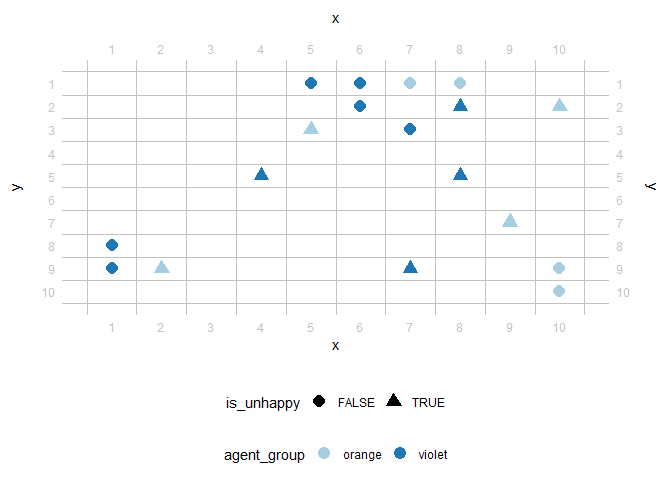

    #> [1] "Tick 2 finished in 0.322 secs:"
    #> [1] "  - share_unhappy: NA"

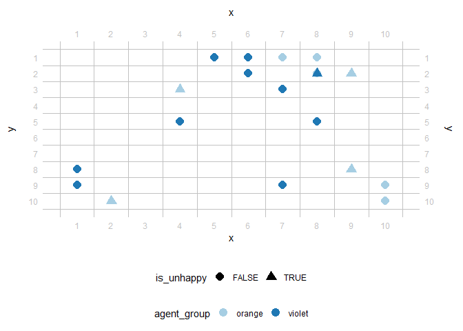

    #> [1] "Tick 3 finished in 0.239 secs:"
    #> [1] "  - share_unhappy: NA"

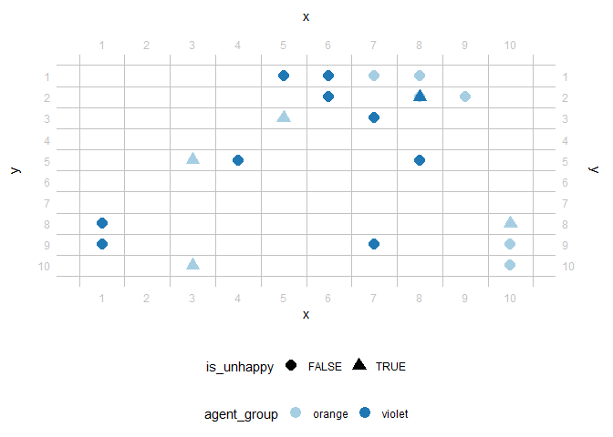

    #> [1] "Tick 4 finished in 0.233 secs:"
    #> [1] "  - share_unhappy: NA"


    #> [1] "Tick 5 finished in 0.23 secs:"
    #> [1] "  - share_unhappy: NA"


    #> [1] "Tick 6 finished in 0.224 secs:"
    #> [1] "  - share_unhappy: NA"

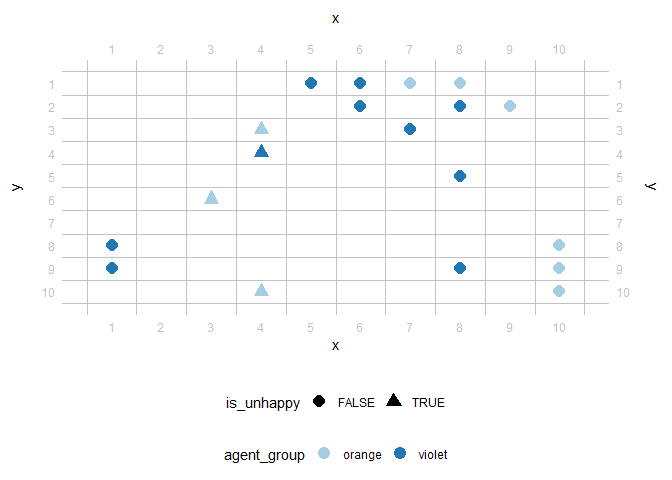

    #> [1] "Tick 7 finished in 0.217 secs:"
    #> [1] "  - share_unhappy: NA"

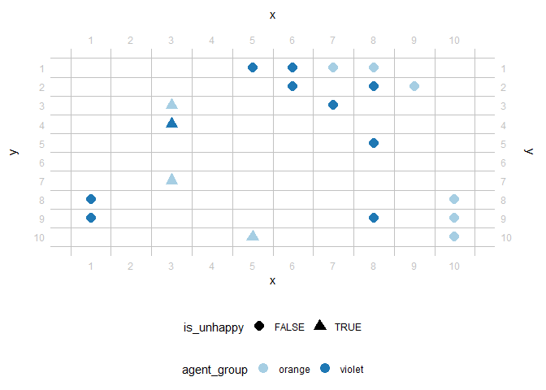

    #> [1] "Tick 8 finished in 0.258 secs:"
    #> [1] "  - share_unhappy: NA"


    #> [1] "Tick 9 finished in 0.198 secs:"
    #> [1] "  - share_unhappy: NA"

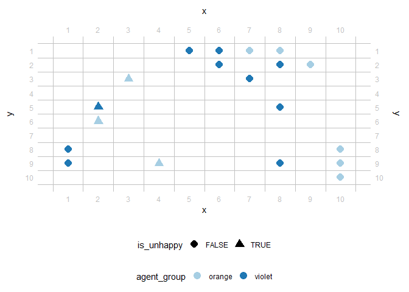

    #> [1] "Tick 10 finished in 0.237 secs:"
    #> [1] "  - share_unhappy: NA"

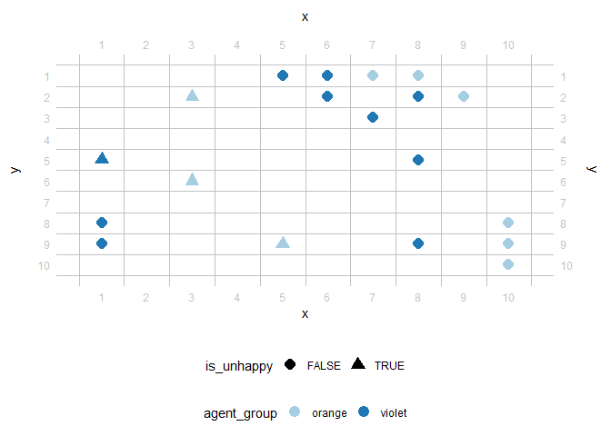

    #> [1] "Tick 11 finished in 0.213 secs:"
    #> [1] "  - share_unhappy: NA"


    #> [1] "Tick 12 finished in 0.202 secs:"
    #> [1] "  - share_unhappy: NA"


    #> [1] "Tick 13 finished in 0.194 secs:"
    #> [1] "  - share_unhappy: NA"

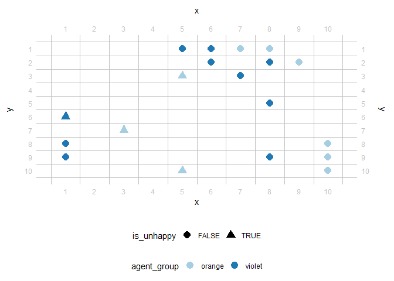

    #> [1] "Tick 14 finished in 0.2 secs:"
    #> [1] "  - share_unhappy: NA"


    #> [1] "Tick 15 finished in 0.202 secs:"
    #> [1] "  - share_unhappy: NA"

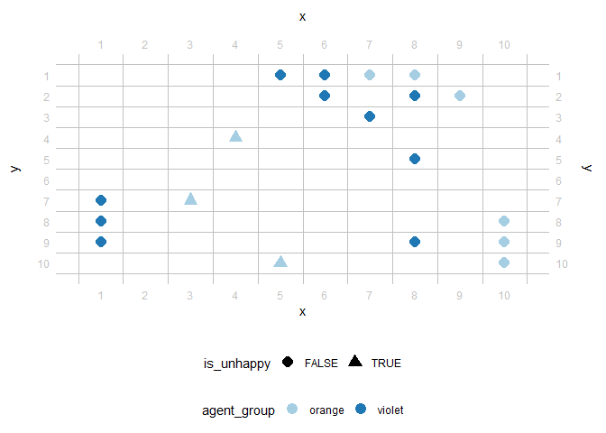

    #> [1] "Tick 16 finished in 0.319 secs:"
    #> [1] "  - share_unhappy: NA"

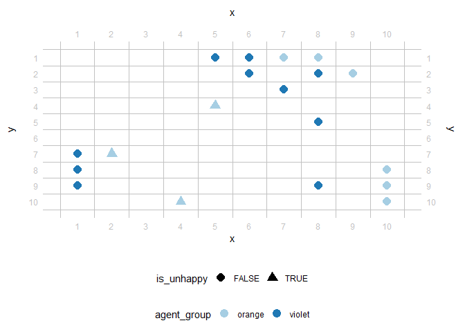

    #> [1] "Tick 17 finished in 0.21 secs:"
    #> [1] "  - share_unhappy: NA"


    #> [1] "Tick 18 finished in 0.221 secs:"
    #> [1] "  - share_unhappy: NA"


    #> [1] "Tick 19 finished in 0.234 secs:"
    #> [1] "  - share_unhappy: NA"


    #> [1] "Tick 20 finished in 0.19 secs:"
    #> [1] "  - share_unhappy: NA"


    #> [1] "Tick 21 finished in 0.213 secs:"
    #> [1] "  - share_unhappy: NA"

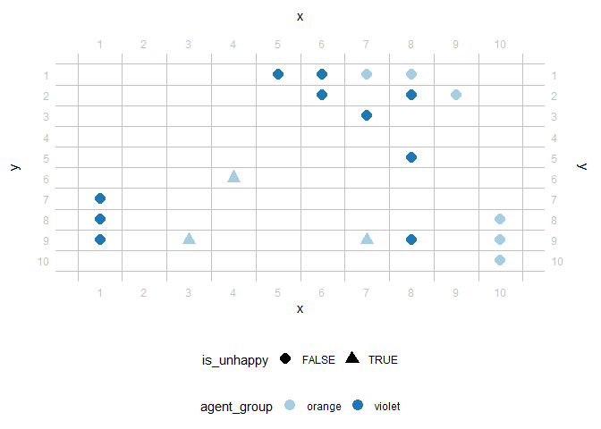

    #> [1] "Tick 22 finished in 0.208 secs:"
    #> [1] "  - share_unhappy: NA"

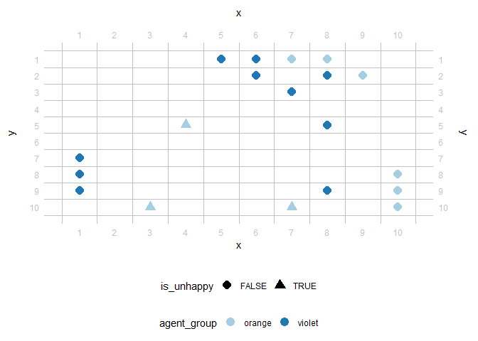

    #> [1] "Tick 23 finished in 0.188 secs:"
    #> [1] "  - share_unhappy: NA"


    #> [1] "Tick 24 finished in 0.202 secs:"
    #> [1] "  - share_unhappy: NA"


    #> [1] "Tick 25 finished in 0.208 secs:"
    #> [1] "  - share_unhappy: NA"


    #> [1] "Tick 26 finished in 0.202 secs:"
    #> [1] "  - share_unhappy: NA"


    #> [1] "Tick 27 finished in 0.192 secs:"
    #> [1] "  - share_unhappy: NA"


    #> [1] "Tick 28 finished in 0.237 secs:"
    #> [1] "  - share_unhappy: NA"


    #> [1] "Tick 29 finished in 0.214 secs:"
    #> [1] "  - share_unhappy: NA"


    #> [1] "Tick 30 finished in 0.198 secs:"
    #> [1] "  - share_unhappy: NA"


    #> [1] "Tick 31 finished in 0.211 secs:"
    #> [1] "  - share_unhappy: NA"


    #> [1] "Tick 32 finished in 0.193 secs:"
    #> [1] "  - share_unhappy: NA"

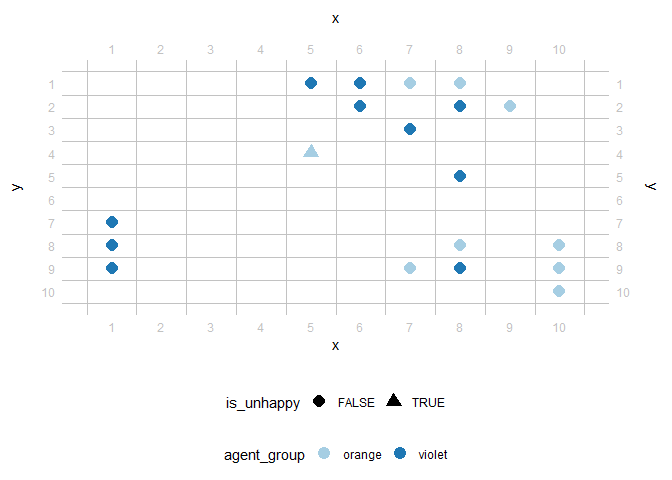

    #> [1] "Tick 33 finished in 0.192 secs:"
    #> [1] "  - share_unhappy: NA"


    #> [1] "Tick 34 finished in 0.198 secs:"
    #> [1] "  - share_unhappy: NA"


    #> [1] "Tick 35 finished in 0.245 secs:"
    #> [1] "  - share_unhappy: NA"


    #> [1] "Tick 36 finished in 0.261 secs:"
    #> [1] "  - share_unhappy: NA"


    #> [1] "Tick 37 finished in 0.246 secs:"
    #> [1] "  - share_unhappy: NA"


    #> [1] "Tick 38 finished in 0.27 secs:"
    #> [1] "  - share_unhappy: NA"


    #> [1] "Tick 39 finished in 0.219 secs:"
    #> [1] "  - share_unhappy: NA"


    #> [1] "Tick 40 finished in 0.333 secs:"
    #> [1] "  - share_unhappy: NA"


    #> [1] "Tick 41 finished in 0.259 secs:"
    #> [1] "  - share_unhappy: NA"


    #> [1] "Tick 42 finished in 0.222 secs:"
    #> [1] "  - share_unhappy: NA"


    #> [1] "Tick 43 finished in 0.214 secs:"
    #> [1] "  - share_unhappy: NA"


    #> [1] "Tick 44 finished in 0.225 secs:"
    #> [1] "  - share_unhappy: NA"

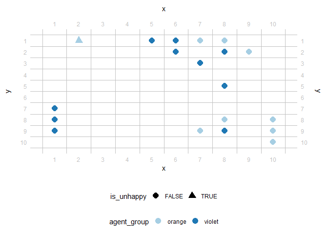

    #> [1] "Tick 45 finished in 0.305 secs:"
    #> [1] "  - share_unhappy: NA"


    #> [1] "Tick 46 finished in 0.193 secs:"
    #> [1] "  - share_unhappy: NA"


    #> [1] "Tick 47 finished in 0.198 secs:"
    #> [1] "  - share_unhappy: NA"


    #> [1] "Tick 48 finished in 0.199 secs:"
    #> [1] "  - share_unhappy: NA"


    #> [1] "Tick 49 finished in 0.199 secs:"
    #> [1] "  - share_unhappy: NA"


    #> [1] "Tick 50 finished in 0.199 secs:"
    #> [1] "  - share_unhappy: NA"


When it’s done, *tidyABM* provides us with statistics about each
iteration. Oh, and since it’s a tidy package, of course these statistics
come in the form of [tibbles](https://tibble.tidyverse.org/).

``` r
e
#> # A tibble: 50 × 5
#>    .tick .runtime       .n_agents_after_tick .finished_after_tick share_unhappy
#>  * <dbl> <drtn>                        <int> <lgl>                        <dbl>
#>  1     1 0.4959540 secs                   20 FALSE                           NA
#>  2     2 0.3221130 secs                   20 FALSE                           NA
#>  3     3 0.2389641 secs                   20 FALSE                           NA
#>  4     4 0.2329090 secs                   20 FALSE                           NA
#>  5     5 0.2297959 secs                   20 FALSE                           NA
#>  6     6 0.2243018 secs                   20 FALSE                           NA
#>  7     7 0.2168710 secs                   20 FALSE                           NA
#>  8     8 0.2576191 secs                   20 FALSE                           NA
#>  9     9 0.1983490 secs                   20 FALSE                           NA
#> 10    10 0.2367611 secs                   20 FALSE                           NA
#> # ℹ 40 more rows
```

We can also take a look at all the agents (not only the two blueprints
from the beginning but all of the added ones), also in a tidy format.

``` r
e %>% 
  convert_agents_to_tibble()
#> # A tibble: 20 × 6
#>    .id   agent_group    .x    .y similar is_unhappy
#>    <chr> <chr>       <int> <int>   <dbl> <lgl>     
#>  1 A1    orange         10     9   1     FALSE     
#>  2 A2    orange          8     1   1     FALSE     
#>  3 A3    orange          4     3   1     FALSE     
#>  4 A4    orange          5     3   0.5   FALSE     
#>  5 A5    orange          3     9 NaN     NA        
#>  6 A6    orange         10    10   1     FALSE     
#>  7 A7    orange          9     1   1     FALSE     
#>  8 A8    orange          9     7 NaN     NA        
#>  9 A9    orange          8     2   0.6   FALSE     
#> 10 A10   orange          7     1   0.5   FALSE     
#> 11 A11   violet          8     3   0.5   FALSE     
#> 12 A12   violet          8     9 NaN     NA        
#> 13 A13   violet          3     6 NaN     NA        
#> 14 A14   violet          7     6 NaN     NA        
#> 15 A15   violet          6     1   0.667 FALSE     
#> 16 A16   violet          5     1   1     FALSE     
#> 17 A17   violet          7     3   0.667 FALSE     
#> 18 A18   violet          1     8   1     FALSE     
#> 19 A19   violet          6     2   0.6   FALSE     
#> 20 A20   violet          1     9   1     FALSE
```

There’s of course more to explore and the possibilities are huge,
particularly with the flexible triangle of characteristics, variables,
and rules. For example, *tidyABM* is not only capable of handling grid
environments but also others and each environment comes with their own
helping utilities to inform variables and rules. Also, *tidyABM* can
help write-up your [ODD protocols](https://doi.org/10.18564/jasss.4259).
And it comes with quite a few vignettes for common ABM introductory
simulations such as Schelling’s seggregation we kind-of looked into
here.

``` r
browseVignettes('tidyabm')
#> Keine Vignetten gefunden durch browseVignettes("tidyabm")
```

## Issues and Citation

Feel free to contribute to this package, either by providing feedback
(via the [issues](https://github.com/datenfruehstueck/tidyabm/issues))
or by providing code (via the [pull
requests](https://github.com/datenfruehstueck/tidyabm/pulls)).

If you use this package I would appreciate you citing it, for example
like so:

[Haim, Mario](https://haim.it/) (2023). tidyABM: Set up, run, and
document agent-based models (ABM) the tidy way. Source code and releases
available at <https://github.com/datenfruehstueck/tidyABM/>.
